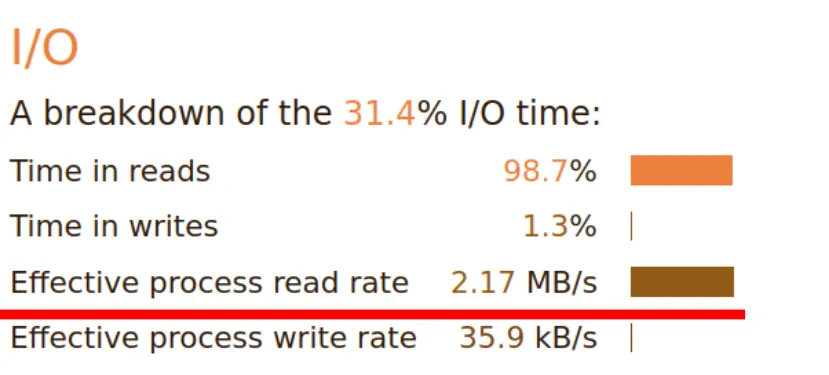
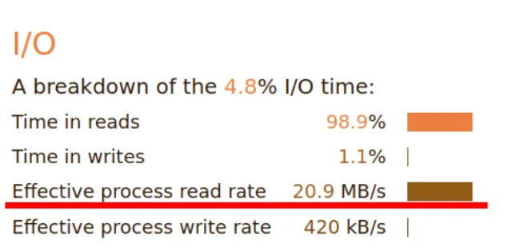
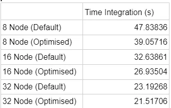
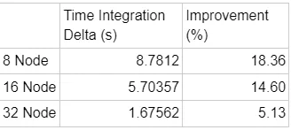
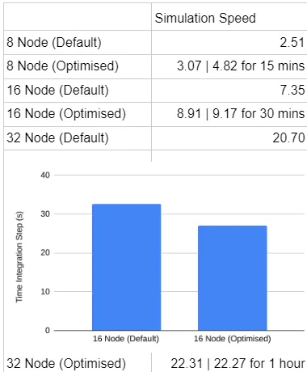
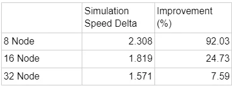
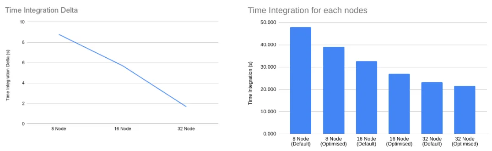
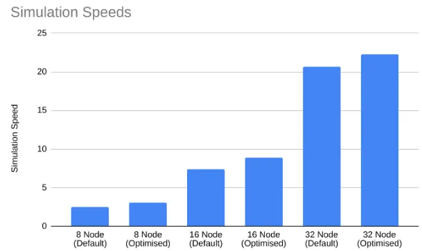

### MPAS 

#### 概述  
跨尺度预测模型（Model for Prediction Across Scales，MPAS）是一个协作开发项目，旨在创建用于气候、区域气候和天气研究的模拟组件，包括大气、海洋及其他地球系统模拟。  

MPAS 采用非结构化 Voronoi 网格和 C 网格离散化，作为高分辨率气候和中尺度大气模拟的基础。  

#### 软件版本  
我们使用了与提供的脚本中相同版本的库和软件：  
- **HDF5**: 1.12.1  
- **PNETCDF**: 1.12.3  
- **NETCDF**: 4.8.1  
- **PIO**: 2.5.9  
- **NETCDF_FORTRAN**: 4.6.1  
- **METIS**: 5.1.0  
- **MPAS-Model**: 7.3  

#### 优化策略  
我们主要针对 MPAS-Atmosphere 的三个部分进行性能优化：  
1. **MPAS-Model 源代码**  
2. **Namelist.atmosphere 文件**（主要是 PIO 配置；其他更改可能会改变模型/物理过程，导致结果无效）  
3. **编译优化**  

最终，仅通过修改 namelist 文件中的 PIO 配置和进行编译优化取得了成功。  

#### PIO 配置修改  
默认设置为：  
```  
config_pio_num_iotasks = 0  
config_pio_stride = 1  
```  

调整后的参数为：  
```  
config_pio_num_iotasks = 48  
config_pio_stride = 8/16/32  
```  

这一调整提高了 I/O 时间内的有效进程读取速率，达到 **18 MB/s**。这可能是由于增加的步长（stride）允许数据的传输更加有效。  

#### 测试结果  
在测试中，每节点 **48 核** 的配置表现最佳。  
将步长从 1 改为 8 时，有效减少了 I/O 开销。  

**优化前：**  


**优化后：**  



#### 编译器优化标志  
C/C++ 和 Fortran 编译器提供通过 `-O` 表示的优化标志。默认情况下，该标志设置为 `O3`，这是符合标准的最高优化级别。然而，我们也可以使用 `-Ofast`，它不受标准约束，并启用进一步优化，如 `-ffast-math`、`-fallow-store-data-races` 和 Fortran 特定的 `-fstack-arrays`。  

由于我们在 Gadi 平台的普通 CPU 实例中使用的是 Intel Platinum 8268 处理器（属于 Cascade Lake 系列），这些处理器支持 AVX512 指令集。在编译时，我们使用了 `-mavx512f` 标志来启用此特性。  

#### 默认编译标志  
```  
FFLAGS_OPT = -O3 -ffree-line-length-none -fconvert=big-endian -ffree-form  
CFLAGS_OPT = -O3  
CXXFLAGS_OPT = -O3  
LDFLAGS = -O3  
```  

#### 调整后的配置  
```  
FFLAGS_OPT = -Ofast -ffree-line-length-none -fconvert=big-endian -ffree-form -mavx512f  
CFLAGS_OPT = -Ofast -mavx512f  
CXXFLAGS_OPT = -Ofast -mavx512f  
LDFLAGS = -Ofast -mavx512f  
```  

#### 优化效果  
所有这些调整使得在 8 节点实例上的时间积分计算时间减少了 **18%**，从而提高了总体模拟速度。然而，优化的扩展性不佳。在 32 节点实例中，性能提升仅约为 **5%**。  

#### 结果  















#### 我们还尝试了以下方法，但未成功：  
1. **使用 IntelMPI 替代 OpenMPI 编译库和 MPAS-Model** -> 编译失败  
2. **用 OpenMP 编译 MPAS-Model** -> 性能无提升/性能更差  
3. **通过直接编辑 Fortran 源代码改进 MPAS-Model 的算法和代码效率** -> 导致编译失败或数值错误  
4. **对 MPAS-Model 的各个函数和 MPI 调用进行性能分析** -> 无法获得满意的结果/运行时出现错误  
5. **在运行模拟的 PBS 脚本中添加 `–map-by core` 和 `–bind-by core` 标志** -> 性能无变化  

---

#### 结论  
2023 年 APAC HPC-AI 竞赛对 MDN/Monash 团队来说是一段既具挑战性又富有收获的经历。尽管晚于官方参赛日期进入比赛，团队在学习和应用 MPAS-Atmosphere 和 Bloom 优化技术方面表现出极大的投入。然而，两个应用仍有许多改进空间。  

尽管团队遇到了一些技术难题，例如内存限制和较长的加载时间，他们始终努力寻找创新解决方案，并在面对困难时表现出韧性。然而，特别是针对 MPAS，我们在应用某些优化技术编译软件时遇到了诸多问题，再加上学术任务的压力，团队未能投入足够的时间进行调试和探索进一步的优化。此外，我们发现 MPAS 中使用的 Fortran 和数学背景存在一些不足，这进一步减缓了优化进度。  

这场比赛为团队提供了一个卓越的平台，让他们熟悉各种尖端优化方法的复杂性。团队深入研究了深度学习优化技术，并从中获得了巨大的乐趣。  

展望未来，MDN 团队致力于将本次比赛中学到的经验融入未来的项目和竞赛中。我们将努力提升技术能力、增强合作技巧，并探索在资源受限条件下优化软件性能的更多方法。  

团队对主办方提供这一宝贵的国际竞赛机会表示衷心感谢。这场比赛不仅挑战了他们的技术能力，还在团队成员之间培养了合作精神和创新意识，为他们的学术和职业生涯留下了深远的影响。  


Reference
1. Hugging Face. (2022). The Technology Behind BLOOM Training. Retrieved from https://huggingface.co/blog/bloom-megatron-deepspeed

2. Hugging Face. (2022). A Gentle Introduction to 8-bit Matrix Multiplication for transformers at scale using Hugging Face Transformers, Accelerate and bitsandbytes. Retrieved from https://huggingface.co/blog/hf-bitsandbytes-integration

3. Tim D. (2022). LLM.int8(): 8-bit Matrix Multiplication for Transformers at Scale. arXiv preprint arXiv:2208.07339. Retrieved from https://arxiv.org/abs/2208.07339

4. Axelera AI. (2023). Decoding Transformers on Edge Devices. Retrieved from https://www.axelera.ai/decoding-transformers-on-edge-devices/

5. Yaniv L. (2022). Fast Inference from Transformers via Speculative Decoding. arXiv preprint arXiv:2211.17192. Retrieved from https://arxiv.org/abs/2211.17192

6. Hugging Face. (2022). bloom-inference-scripts. Retrieved from https://github.com/huggingface/transformers-bloom-inference/tree/main/bloom-inference-scripts

7. Microsoft Research. (2023). ZeRO & DeepSpeed: New system optimizations enable training models with over 100 billion parameters. Retrieved from https://www.microsoft.com/en-us/research/blog/zero-deepspeed-new-system-optimizations-enable-training-models-with-over-100-billion-parameters/

8. Weng, L. (2021). How to Train Really Large Models on Many GPUs? Retrieved from https://lilianweng.github.io/posts/2021-09-25-train-large/

Colossal AI. (2023.). Paradigms of Parallelism. Retrieved from https://colossalai.org/docs/concepts/paradigms_of_parallelism/