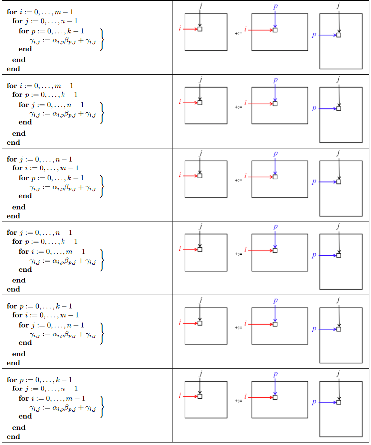

[root@mpas src]# ls /boot | grep vmlinu
vmlinuz-0-rescue-444acb10af184d21a6cbb4fe3cceefb4
vmlinuz-4.18.0-193.el8.x86_64
vmlinuz-4.18.0-348.7.1.el8_5.x86_64

[root@mpas src]# rpm -aq |grep kernel-devel
kernel-devel-4.18.0-348.7.1.el8_5.x86_64
kernel-devel-4.18.0-193.el8.x86_64