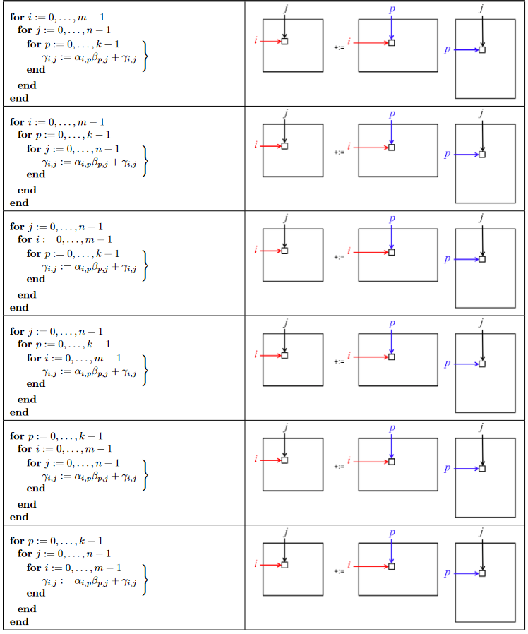
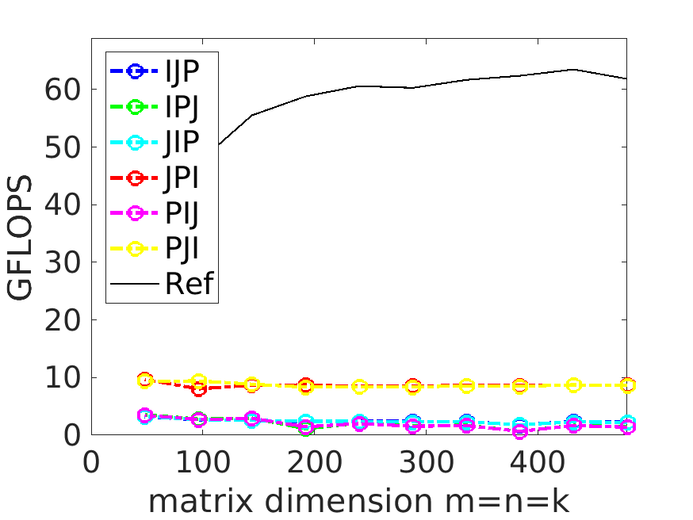
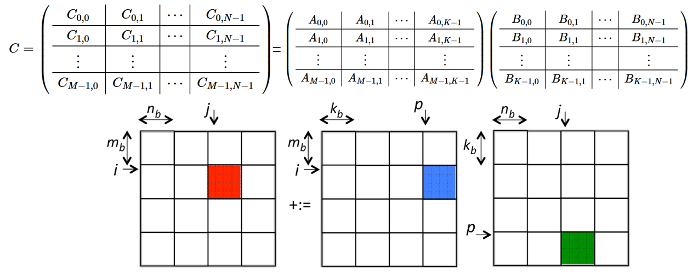
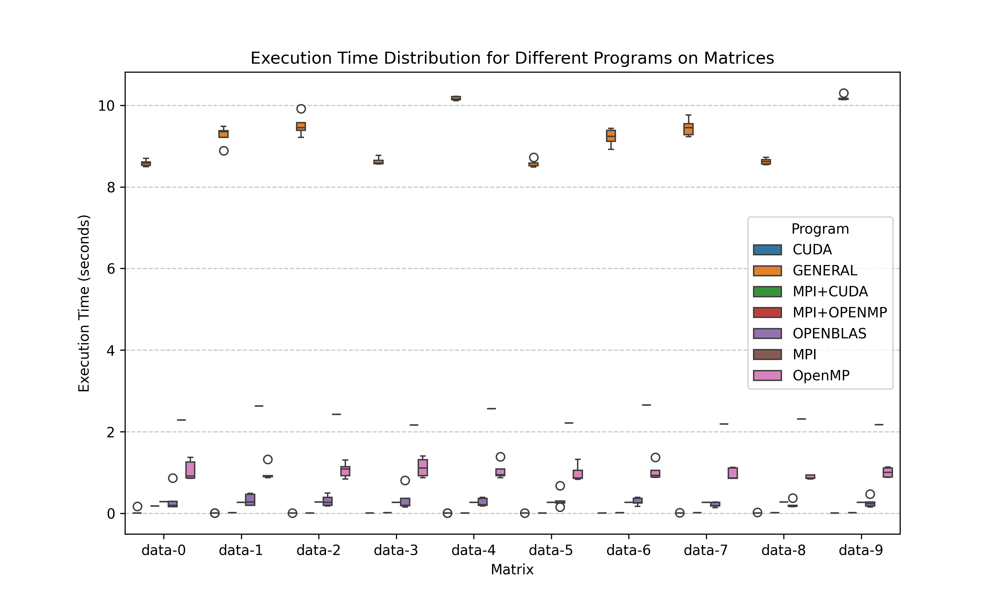
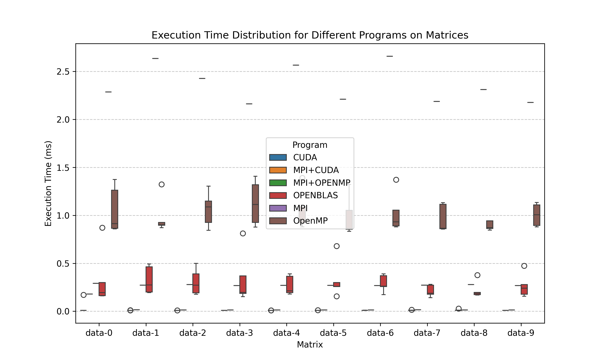
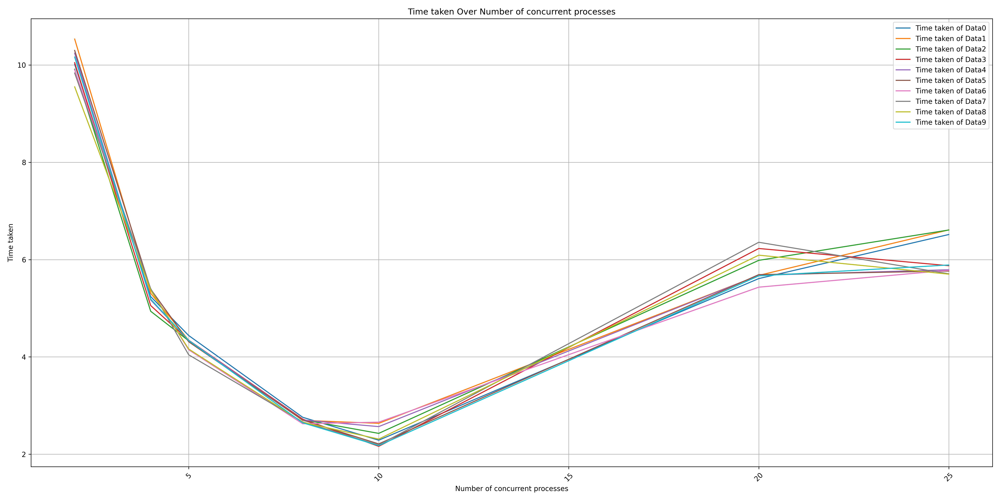
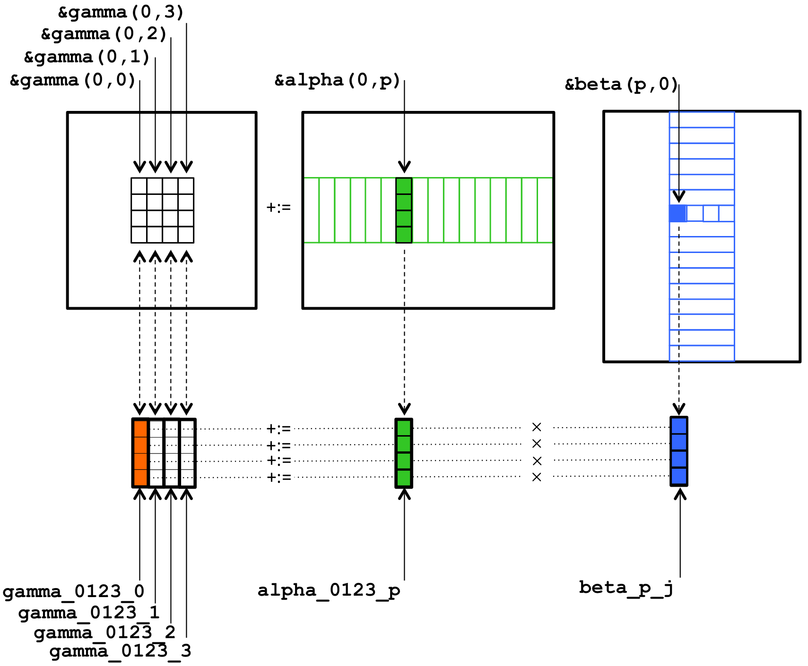

# LzuOssHPC-2023 sci-3

**姓名：孟宇晨**

**班级：2022级计算机基地班**

**学号：320220930260**

## 学会 OpenMP、MPI、CUDA 程序编译，学会 BLAS 库的编译使用。学习一些基本的使用 OpenMP、MPI 等进行上层算法优化的知识。

## 解决的问题：即给定 A、B 矩阵的矩阵乘法，数据集使用其中的 datagen 进行生成。

>本次报告的写作思路和对矩阵乘法的思考主要参考了[高性能计算初步：矩阵乘法](https://www.twisted-meadows.com/high-performance-gemm/)

>本次报告所包含的所有代码、输出日志已均上传到github上。

**目录：**
- [LzuOssHPC-2023 sci-3](#lzuosshpc-2023-sci-3)
  - [学会 OpenMP、MPI、CUDA 程序编译，学会 BLAS 库的编译使用。学习一些基本的使用 OpenMP、MPI 等进行上层算法优化的知识。](#学会-openmpmpicuda-程序编译学会-blas-库的编译使用学习一些基本的使用-openmpmpi-等进行上层算法优化的知识)
  - [解决的问题：即给定 A、B 矩阵的矩阵乘法，数据集使用其中的 datagen 进行生成。](#解决的问题即给定-ab-矩阵的矩阵乘法数据集使用其中的-datagen-进行生成)
  - [编译所用的环境](#编译所用的环境)
  - [一、分析源代码给定的矩阵乘法](#一分析源代码给定的矩阵乘法)
    - [1.1 程序执行的流程以及进行矩阵乘法的原理](#11-程序执行的流程以及进行矩阵乘法的原理)
      - [流程：](#流程)
      - [串行乘法矩阵乘法的原理](#串行乘法矩阵乘法的原理)
      - [矩阵乘法流程](#矩阵乘法流程)
      - [OpenBLAS调用的函数](#openblas调用的函数)
      - [MPI矩阵乘法程序流程](#mpi矩阵乘法程序流程)
      - [主进程进行验证：](#主进程进行验证)
      - [MPI矩阵乘法](#mpi矩阵乘法)
      - [OpenMP矩阵乘法流程](#openmp矩阵乘法流程)
      - [cuda矩阵乘法流程及具体分析](#cuda矩阵乘法流程及具体分析)
    - [1.2 比较串行程序和 MPI、OPENMP、CUDA、OpenBlas 程序的不同](#12-比较串行程序和-mpiopenmpcudaopenblas-程序的不同)
      - [1. **串行程序**（Naive Algorithm）](#1-串行程序naive-algorithm)
      - [2. **MPI**（Message Passing Interface）](#2-mpimessage-passing-interface)
      - [3. **OpenMP**（Open Multi-Processing）](#3-openmpopen-multi-processing)
      - [4. **CUDA**（Compute Unified Device Architecture）](#4-cudacompute-unified-device-architecture)
      - [5. **OpenBLAS**（Open Basic Linear Algebra Subprograms）](#5-openblasopen-basic-linear-algebra-subprograms)
      - [比较总结：](#比较总结)
  - [二、手动编译源代码](#二手动编译源代码)
    - [2.1 编译源代码所用命令](#21-编译源代码所用命令)
    - [**1. datagen.cpp**](#1-datagencpp)
    - [**2. matrix\_cal\_general.cpp**](#2-matrix_cal_generalcpp)
    - [**3. matrix\_cal\_cuda.cu**](#3-matrix_cal_cudacu)
    - [**4. matrix\_cal\_mpi\_cuda.cu**](#4-matrix_cal_mpi_cudacu)
      - [第一步：编译CUDA代码](#第一步编译cuda代码)
      - [第二步：链接生成可执行文件](#第二步链接生成可执行文件)
    - [**5. matrix\_cal\_openmp.cpp**](#5-matrix_cal_openmpcpp)
    - [**6. matrix\_cal\_mpi.cpp**](#6-matrix_cal_mpicpp)
    - [**7. matrix\_cal\_openblas.cpp**](#7-matrix_cal_openblascpp)
    - [**8. matrix\_cal\_mpi\_openmp**](#8-matrix_cal_mpi_openmp)
    - [2.2 性能测试表格及Python绘制图表](#22-性能测试表格及python绘制图表)
  - [三、制作Makefile脚本自动化构建](#三制作makefile脚本自动化构建)
    - [3.1 制作Makefile自动化构建datagen以及矩阵乘法源代码](#31-制作makefile自动化构建datagen以及矩阵乘法源代码)
    - [**定义变量**](#定义变量)
      - [**编译器及工具**](#编译器及工具)
      - [**编译标志**](#编译标志)
      - [**目标路径**](#目标路径)
      - [**目标文件名**](#目标文件名)
    - [**规则部分**](#规则部分)
      - [**总目标**](#总目标)
      - [**编译各个目标程序**](#编译各个目标程序)
        - [**编译`datagen`**](#编译datagen)
        - [**编译`matrix_cal_general`**](#编译matrix_cal_general)
        - [**编译`matrix_cal_cuda`**](#编译matrix_cal_cuda)
        - [**编译`matrix_cal_mpi_cuda`**](#编译matrix_cal_mpi_cuda)
        - [**编译`matrix_cal_openmp`**](#编译matrix_cal_openmp)
        - [**编译`matrix_cal_mpi`**](#编译matrix_cal_mpi)
        - [**编译`matrix_cal_openblas`**](#编译matrix_cal_openblas)
        - [**编译`matrix_cal_mpi_openmp`**](#编译matrix_cal_mpi_openmp)
      - [**清理目标**](#清理目标)
    - [3.2 制作Makefile自动化脚本生成日志，存放在logs目录。](#32-制作makefile自动化脚本生成日志存放在logs目录)
      - [**日志目录**](#日志目录)
  - [四、优化源代码](#四优化源代码)
    - [4.1 比较不同进程数量下矩阵乘法的执行时间](#41-比较不同进程数量下矩阵乘法的执行时间)
    - [结论与启示：](#结论与启示)
    - [4.2 分析亲和度绑定以及使用机器的结构](#42-分析亲和度绑定以及使用机器的结构)
    - [**亲和度绑定的解释**](#亲和度绑定的解释)
    - [**使用机器的结构**](#使用机器的结构)
      - [1. **整体概述**](#1-整体概述)
      - [2. **Package L#0 和 Package L#1**](#2-package-l0-和-package-l1)
      - [3. **NUMA 节点**](#3-numa-节点)
      - [4. **L3/L2/L1 缓存**](#4-l3l2l1-缓存)
    - [**亲和度绑定策略**](#亲和度绑定策略)
    - [**设置 MPI 和 OpenMP 的亲和度绑定**](#设置-mpi-和-openmp-的亲和度绑定)
      - [1. **MPI**](#1-mpi)
      - [2. **OpenMP**](#2-openmp)
    - [**性能对比：不同亲和度绑定策略的影响**](#性能对比不同亲和度绑定策略的影响)
    - [4.3 针对 OPENMP、MPI、MPI + OPENMP 程序对缓存利用进行分析](#43-针对-openmpmpimpi--openmp-程序对缓存利用进行分析)
    - [1. **OPENMP 程序的缓存优化**](#1-openmp-程序的缓存优化)
      - [(1) **数据块划分（Blocking）**](#1-数据块划分blocking)
      - [(2) **线程局部数据（Thread-local data）**](#2-线程局部数据thread-local-data)
      - [(3) **优化访问模式**](#3-优化访问模式)
      - [(4) **限制伪共享（False Sharing）**](#4-限制伪共享false-sharing)
    - [2. **MPI 程序的缓存优化**](#2-mpi-程序的缓存优化)
      - [(1) **减少跨节点通信**](#1-减少跨节点通信)
      - [(2) **通信聚合（Communication Aggregation）**](#2-通信聚合communication-aggregation)
      - [(3) **数据局部性优化**](#3-数据局部性优化)
      - [(4) **合理的内存布局**](#4-合理的内存布局)
    - [3. **MPI + OPENMP 程序的缓存优化**](#3-mpi--openmp-程序的缓存优化)
      - [(1) **合理的线程和进程映射**](#1-合理的线程和进程映射)
      - [(2) **减少数据传输**](#2-减少数据传输)
      - [(3) **任务划分与数据划分的协同**](#3-任务划分与数据划分的协同)
      - [(4) **混合模型的缓存优化**](#4-混合模型的缓存优化)
    - [4.4  SIMD 优化的矩阵乘法程序](#44--simd-优化的矩阵乘法程序)
    - [常量和函数](#常量和函数)
  - [五、收获总结](#五收获总结)

## 编译所用的环境 
| Component                  | Version                              |
|----------------------------|--------------------------------------|
| **Operating System**        | Ubuntu 22.04                         |
| **g++ Compiler**            | g++ (Ubuntu 11.4.0-1ubuntu1~22.04) 11.4.0 |
| **CUDA Compilation Tools**  | CUDA Compilation Tools V11.8.89      |
| **MPI**                     | Open MPI 4.1.2                       |
| **OpenBLAS**                | OpenBLAS 0.3.20                      |
| **NVIDIA-SMI**              | 550.54.15                            |
| **Driver Version**          | 550.54.15                            |
| **CUDA Version**            | CUDA Version 12.4                    |

  
## 一、分析源代码给定的矩阵乘法

### 1.1 程序执行的流程以及进行矩阵乘法的原理
---
**1.1.1 串行乘法**

#### 流程：

（1） **读取输入参数**:
   - 程序从命令行参数中读取文件夹路径。如果未提供，默认使用当前目录 `./`。
   - 该路径用于获取矩阵数据文件。

（2）**读取数据文件列表**:
   - 调用 `get_files(folder)` 函数，获取文件夹下所有测试数据文件的分组信息。
   - 数据文件按矩阵规模（元组 `(m, n, p)` 表示）进行分组，每个分组包含相同规模矩阵的多个文件。

（3） **逐组处理数据文件**:
   - 对于每个矩阵规模 `(m, n, p)`：
     - 输出矩阵的规模，并标记将对每个数据文件重复测量 5 次。

（4 ）**逐文件处理**:
   - 对每个数据文件：
     - 使用 `get_matrixs(file)` 读取矩阵数据，返回包含三个矩阵的元组 `(m1, m2, m3)`：
       - `m1` 为大小为 \( m \times n \) 的矩阵。
       - `m2` 为大小为 \( n \times p \) 的矩阵。
       - `m3` 为期望结果矩阵，大小为 \( m \times p \)。
     - 如果矩阵数据读取成功，继续后续操作；否则返回失败。

（4）**初始化结果矩阵**:
   - 动态分配内存，创建一个大小为 \( m \times p \) 的矩阵 `answer`，初始化所有元素为 0。

（5）**串行矩阵乘法计算**:
   - 使用三重循环实现串行矩阵乘法计算：
     \[
     \text{answer}[i][j] = \sum_{k=0}^{n-1} m1[i][k] \times m2[k][j]
     \]
     - 外层循环遍历结果矩阵的行索引 \( i \)。
     - 中间循环遍历结果矩阵的列索引 \( j \)。
     - 内层循环累加 \( m1[i][k] \times m2[k][j] \) 到结果矩阵。

（6）**验证计算结果**:
   - 遍历 `answer` 矩阵的每个元素，与期望结果矩阵 `m3` 比较：
     - 如果任一元素的绝对误差大于设定的容差 `EPSILON`，验证失败，输出详细的错误信息（包括错误位置、错误值以及原始矩阵数据）。
     - 如果所有元素验证成功，记录耗时并打印。

（7） **清理内存**:
   - 释放动态分配的矩阵内存：`m1`, `m2`, `m3`, 和 `answer`。

（8） **重复测量**:
   - 对每个数据文件重复测量 5 次，并交替执行计算。

（9） **结束程序**:
    - 所有测试文件处理完成后，输出“测量结束”并返回成功状态。


#### 串行乘法矩阵乘法的原理

串行乘法所用的原理即朴素算法

对于两个矩阵：
- \( A \) 是大小为 \( m \times n \) 的矩阵。
- \( B \) 是大小为 \( n \times p \) 的矩阵。
- \( C \) 是结果矩阵，大小为 \( m \times p \)。

结果矩阵的元素 \( C[i][j] \) 是 \( A \) 的第 \( i \) 行与 \( B \) 的第 \( j \) 列的点积：


$$ C[i][j] = \sum_{k=0}^{n-1} A[i][k] \times B[k][j] $$


在实现程序中：
1. 外层循环遍历 \( C \) 的每一行 \( i \)。
2. 中间循环遍历 \( C \) 的每一列 \( j \)。
3. 内层循环累加  （遍历 \( k \)）。

$$ A[i][k] \times B[k][j] $$


因为数据在**存储介质间的 IO**对实际运算速度有巨大影响，所以在朴素算法中我们可以改变循环的循序查看是否可以优化效率，且最终结果相同。在实现程序中的123步是可以相互调换的，因此有6种可能性。



用这些版本计算各尺寸的矩阵，将计算效率以 GFLOPS（每秒能够执行的十亿次浮点运算）表示（如下图），最快的遍历为JPI。这是因为在C++中数组列优先存储，矩阵数据在内存中是连续存储的，因此JPI遍历方式可以最大化连续访问地址。


---

**1.1.2 OpenBLAS矩阵乘法**

#### 矩阵乘法流程

流程与朴素算法实现流程相似，不同的是OpenBLAS调用了**cblas_dgemm**实现矩阵乘法。

#### OpenBLAS调用的函数
```c
cblas_dgemm(CblasRowMajor, CblasNoTrans, CblasNoTrans,
            m, p, n, 1.0, m1, n, m2, p, 0.0, answer, p);
```
- 参数说明：
    - CblasRowMajor：矩阵采用**行优先**存储。
    - CblasNoTrans：不对矩阵转置。
    - m, p, n：矩阵的规模。
    - 1.0, 0.0：标量因子，乘法结果直接赋值给 answer。

对cblas_dgemm()函数详解可以看 [Blas矩阵乘法参数详解](https://zhuanlan.zhihu.com/p/104287878)。BLAS函数

对比朴素乘法的JPI loop，BLAS库执行相同的运算则要快上5倍：



关于BLAS的实现，比较偏数学，再次不赘述，这篇文章详细解释了[高性能计算简介（一）：初步分析，BLAS，BLIS简介](https://zhuanlan.zhihu.com/p/129187064)

---

**1.1.3 MPI矩阵乘法**

#### MPI矩阵乘法程序流程

基于**MPI**的并行矩阵乘法程序是通过多个进程对矩阵进行分块计算，以加速大规模矩阵乘法的运算过程。

1. 初始化 MPI 和变量

- `MPI_Init` 初始化 MPI 环境，`argc` 和 `argv` 传入主进程的参数。
- `MPI_Comm_rank` 获取当前进程的编号（`rank`），`MPI_Comm_size` 获取进程总数（`size`）。

2. 数据读取与分配

**主进程初始化数据：**

- 主进程（`rank == 0`）通过 `get_files` 函数从指定目录读取文件。
- `files` 是一个包含文件名的字典，键是矩阵的维度（三元组 `(m, n, p)`），值是文件名的列表。

**矩阵的尺寸与验证**

- 因为题目要求使用的数据集的m，n，p应满足m、m*n、m*p能够整除进程数size，所以需要主进程检查矩阵尺寸是否能被进程数整除，若不能整除则终止计算。

3. 广播数据到各个进程

在矩阵乘法的计算过程中，主进程会将必要的数据广播给其他进程：

- **广播是否结束标志：** 主进程广播 `is_end`，指示是否需要终止。
- **广播矩阵的维度（`m`, `n`, `p`）：** 所有进程都需要知道矩阵的尺寸来分配存储空间。

4. 矩阵划分与分发

**主进程分配矩阵数据：**
```cpp
std::vector<double> m1(m * n);  // A矩阵
std::vector<double> m2(n * p);  // B矩阵
std::vector<double> m3(m * p);  // 结果矩阵（仅主进程持有）
```
- `m1` 和 `m2` 分别是矩阵 A 和 B，`m3` 是正确的结果矩阵。

**主进程读取矩阵数据：**

- `get_matrixs` 函数读取指定文件中的矩阵数据，将其存储到 `m1`, `m2`, `m3` 中。

**数据分发：**

- `MPI_Bcast` 广播矩阵 `m2`（B矩阵）到所有进程。
- `MPI_Scatter` 将矩阵 `m1`（A矩阵）分割并分发给各个进程。每个进程接收到 `m1_local`（A矩阵的一部分）。

5. 局部矩阵乘法计算

每个进程计算自己分配到的矩阵部分：

```cpp
for (size_t i = 0; i < m / size; i++) {
    for (size_t j = 0; j < p; j++) {
        for (size_t k = 0; k < n; k++) {
            answer_local[i * p + j] += m1_local[i * n + k] * m2[k * p + j];
        }
    }
}
```
- 进程计算部分矩阵的乘积，并将结果存储在 `answer_local` 中。

6. 汇总结果与验证

**汇总局部结果：**

- `MPI_Gather` 将各个进程计算得到的局部结果汇总到主进程的 `answer` 中。

#### 主进程进行验证：

- 主进程对结果进行验证：比较计算得到的结果和正确答案 `m3`，如果误差超过阈值则认为验证失败。

**7. 循环与结束**

**8. 结束 MPI**

- 程序结束时，调用 `MPI_Finalize` 来清理 MPI 环境。

#### MPI矩阵乘法

朴素算法有一个问题，是面对大矩阵时性能明显下降，因此我们引入分块矩阵，矩阵被切为形如C1,2的小矩阵，则运算被缩减为每次只关注三个小矩阵的运算。在MPI实现中，具体为主程序读取原数据，再广播给所有进程计算自己的矩阵部分。实现分块矩阵并行计算。



---

**1.1.4 OpenMP矩阵乘法及具体分析**


OpenMP的流程与朴素算法相似，不同的是并行化计算矩阵乘法。OpenMP 的 `parallel for` 指令将三重嵌套的循环并行化。`shared` 表示共享数据，`private` 表示每个线程私有的数据。`num_threads`(16) 指定使用 16 个线程进行计算。OpenMP 通过将矩阵的乘法操作分配给多个线程，在多核 CPU 上实现并行计算，从而加速矩阵乘法过程。

#### OpenMP矩阵乘法流程
```cpp
#pragma omp parallel for shared(answer, m1, m2, m, p, n) private(i, j, k) num_threads(16)
for (i = 0; i < m; i++) {
    for (j = 0; j < p; j++) {
        for (k = 0; k < n; k++) {
            answer[i * p + j] += m1[i * n + k] * m2[k * p + j];
        }
    }
}

```

---

**1.1.5 cuda矩阵乘法**


#### cuda矩阵乘法流程及具体分析

1. 使用cuda来加速计算，因此源程序首先定义一个cuda核函数`matrixMultiply`使计算过程在GPU上运行。
```cpp
__global__ void matrixMultiply(double *m1, double* m2, double *answer, size_t m, size_t n, size_t p) {
    size_t row = blockIdx.y * blockDim.y + threadIdx.y;
    size_t col = blockIdx.x * blockDim.x + threadIdx.x;

    if (row < m && col < p) {
        double sum = 0;
        for (size_t k = 0; k < n; k++) {
            sum += m1[row * n + k] * m2[k * p + col];
        }
        answer[row * p + col] = sum;
    }
}
```
这段代码实现了一个矩阵乘法算法，并使用 **CUDA** 来加速计算。它会在每次运行时，从文件读取输入矩阵，执行矩阵乘法，然后将计算结果与预期的答案进行验证。下面我将详细解释代码中的各个部分：

- **`__global__`** 关键字声明该函数为 CUDA 核函数，即运行在 GPU 上。
- `matrixMultiply` 的目的是计算矩阵 `m1` 和矩阵 `m2` 的乘积，结果存储在 `answer` 中。矩阵 `m1` 和 `m2` 分别为大小 `m x n` 和 `n x p` 的矩阵。
- 计算公式：`answer[row, col] = sum(m1[row, k] * m2[k, col])`，即按标准矩阵乘法公式计算每个元素。
- 每个线程计算结果矩阵 `answer` 中对应位置的一个元素，行列索引由 `blockIdx` 和 `threadIdx` 提供。
    - `blockIdx.y` 和 `blockIdx.x` 用于确定当前线程块的位置。
    - `threadIdx.y` 和 `threadIdx.x` 用于确定当前线程在块中的相对位置。
- `blockDim.x` 和 `blockDim.y` 是每个线程块的维度（16x16）。


2. 主函数main

主函数对于数据的处理和验证与朴素算法的相似，不同的是内存分配、数据传输和cuda核函数调用：

- 使用 `cudaMalloc` 在 GPU 上为矩阵 `m1`、`m2` 和结果矩阵 `answer` 分配内存。

- 使用 `cudaMemcpy` 将矩阵 `m1` 和 `m2` 从主机（CPU）内存复制到设备（GPU）内存。

```cpp
dim3 grid((p + 15) / 16, (m + 15) / 16);
dim3 block(16, 16);

matrixMultiply<<<grid, block>>>(dm1, dm2, danswer, m, n, p);
```

- **`dim3 grid` 和 `dim3 block`**: 用于定义 CUDA 核函数的网格和块的大小。这里使用了 16x16 的线程块（每个线程块有 16 行和 16 列，总共 256 个线程）。
- **`matrixMultiply<<<grid, block>>>`**：调用 CUDA 核函数 `matrixMultiply` 进行矩阵乘法计算，`grid` 和 `block` 控制 GPU 上的线程数量和布局。

```cpp
cudaMemcpy(answer, danswer, m * p * sizeof(double), cudaMemcpyDeviceToHost);
```

- 将 GPU 上的结果矩阵从设备内存复制回主机内存，以便后续的验证操作。

---
**1.1.6 cuda和mpi计算矩阵乘法**

使用 MPI 进行进程间通信，并利用 CUDA 加速矩阵乘法。主进程负责读取矩阵数据并将其分发给其他进程。每个进程使用 CUDA 在 GPU 上执行矩阵乘法，最后将结果合并并验证其正确性。

流程实现细节已在上面详细解释。

---
**1.1.7 mpi和openmp计算矩阵乘法**

**MPI的主要功能：**
- 进程初始化和终止：MPI_Init() 和 MPI_Finalize() 分别初始化和终止MPI环境。
- 进程间的任务分配与数据通信：通过 MPI_Bcast() 和 MPI_Scatter()，MPI实现了数据的广播和分发。在主进程（rank 0）初始化数据后，MPI将这些数据分发到各个进程，然后再通过 MPI_Gather() 收集各个进程的结果。

**OpenMP的主要功能：**
OpenMP 被用来加速单个进程内部的矩阵乘法计算，每个进程内部使用 OpenMP 并行化计算自己负责的矩阵部分的乘积。通过 #pragma omp parallel for 指令，矩阵乘法在每个进程内部并行执行。

流程实现细节已在上面详细解释。

---
### 1.2 比较串行程序和 MPI、OPENMP、CUDA、OpenBlas 程序的不同

串行程序与并行编程技术（MPI、OpenMP、CUDA、OpenBLAS）的不同，主要体现在执行模式、计算方式、资源利用和性能优化等方面。下面将详细解释这些技术如何影响程序的执行，并展示它们之间的不同。

#### 1. **串行程序**（Naive Algorithm）
   - **执行模式**：串行程序是最基本的计算方式，所有计算任务由单个计算单元（如CPU）按顺序执行。在矩阵乘法的例子中，算法通过三重循环遍历每个元素，计算相应坐标的结果：
     $$
     C[i][j] = \sum_{k=0}^{n-1} A[i][k] \times B[k][j]$$
   - **计算方式**：每次计算都依赖于前一个计算的结果。没有并行化，所有数据访问和计算操作都是顺序进行的，导致计算速度较慢，尤其在数据量较大时会非常低效。
   - **资源利用**：只使用单个计算核心（通常是CPU）。资源利用率低，无法充分利用现代计算机多核或多GPU的硬件资源。

#### 2. **MPI**（Message Passing Interface）
   - **执行模式**：MPI是分布式内存并行编程模型，适用于多台机器（节点）之间的通信。每个进程运行在独立的内存空间中，进程之间通过消息传递交换数据。
   - **矩阵分块**：在MPI中，矩阵分成多个块，每个进程负责计算一个矩阵块的部分，通常使用 **矩阵分块乘法**：
     - **矩阵A** 被分成若干行或列的块；
     - **矩阵B** 被分成列的块；
     - **矩阵C** 在每个进程中负责其计算结果。
     - 主进程将数据分配给各个工作进程，计算完成后将结果合并到主进程。
   - **计算方式**：并行计算通过多个进程同时执行每个矩阵块的计算，每个进程计算自己的矩阵块，避免了串行程序中的单个计算瓶颈。
   - **资源利用**：MPI能够利用多个计算节点和多个CPU核，具有很高的扩展性，适用于大规模分布式计算。每个进程有自己的内存空间，之间通过显式的消息传递通信。

#### 3. **OpenMP**（Open Multi-Processing）
   - **执行模式**：OpenMP是共享内存并行编程模型，主要用于多核处理器上。线程共享同一内存空间，线程之间可以直接访问共享变量。
   - **线程并发**：OpenMP通过将循环并行化，使用 **多线程并发执行**。在矩阵乘法中，通常会通过 `#pragma omp parallel for` 等指令将外部循环并行化：
     - 每个线程计算矩阵的不同部分，无需数据的显式通信。
   - **计算方式**：OpenMP在计算时不涉及矩阵分块，而是通过线程间的并行来加速计算。每个线程负责一部分数据的计算，线程间通过共享内存访问共同的数据。
   - **资源利用**：OpenMP可以利用多核处理器的多个线程来并行执行任务，因此比串行程序有更高的计算速度，但对于内存访问和同步的效率要求较高，线程数的增加不一定带来线性加速。

#### 4. **CUDA**（Compute Unified Device Architecture）
   - **执行模式**：CUDA是为NVIDIA GPU设计的并行编程模型，能够利用GPU强大的并行计算能力。GPU具有成千上万的计算核心，可以同时处理成千上万的线程。
   - **计算方式**：在CUDA中，程序被拆分成成千上万个并行线程，每个线程执行计算任务的一个小部分。GPU的核心以大规模的线程并行执行，特别适合矩阵乘法这种具有高度并行性的任务。
     - 在矩阵乘法中，CUDA通过块（block）和线程（thread）来管理并行执行。例如，每个线程计算矩阵中某一元素的值，多个线程一起计算矩阵的所有元素。
   - **硬件加速与优化**：CUDA能够利用GPU的硬件加速功能，如SIMD（单指令多数据）架构，利用GPU高速缓存和共享内存优化计算过程。此外，NVIDIA提供了多种数学库（如cuBLAS）来进一步加速线性代数运算。
   - **资源利用**：CUDA充分利用GPU的大量核心进行并行计算，特别适合大规模的数值计算任务。在这种模型下，计算速度比串行和OpenMP要快得多，但对内存和带宽的要求非常高。

#### 5. **OpenBLAS**（Open Basic Linear Algebra Subprograms）
   - **执行模式**：OpenBLAS是一个优化过的高性能数学库，专注于提供高效的线性代数运算（如矩阵乘法、矩阵求逆等）。
   - **优化的计算任务**：OpenBLAS对常见的线性代数操作（如矩阵乘法）进行了高度优化，能够利用多核CPU的并行计算能力，自动调节计算策略。
     - 它通常会根据硬件配置（如CPU型号、核心数等）选择最适合的算法进行运算。比如在矩阵乘法中，OpenBLAS可能使用更适合当前硬件的算法（如Strassen算法或基于块的算法）来提高执行效率。
   - **硬件加速**：OpenBLAS通过利用CPU的SIMD指令集（如Intel的AVX或AMD的FMA指令），实现了对线性代数运算的硬件加速，提供了比普通串行代码更高的性能。
   - **资源利用**：OpenBLAS在多核CPU上可以自动并行化计算任务，最大化CPU资源的利用，提供比串行计算和简单的多线程计算更好的性能。

#### 比较总结：

| **特性**           | **串行程序**              | **MPI**                          | **OpenMP**                      | **CUDA**                     | **OpenBLAS**                 |
|--------------------|---------------------------|----------------------------------|---------------------------------|------------------------------|-----------------------------|
| **执行模式**       | 单线程                    | 分布式内存并行                  | 共享内存并行                   | GPU并行                      | 高效库，多线程并行         |
| **计算方式**       | 串行计算，每次计算一个元素  | 矩阵分块并行计算，各进程计算一部分 | 线程并行计算，同步共享内存     | 使用GPU线程并行计算          | 高效线性代数运算优化       |
| **资源利用**       | 单核CPU                    | 多进程并行，适用于多节点计算      | 多核CPU，通过线程共享内存并行 | 利用GPU的大量计算核心并行    | 利用多核CPU的并行计算能力 |
| **硬件加速**       | 无                         | 无                               | 无                              | GPU硬件加速，cuBLAS库优化    | CPU的SIMD加速               |
| **适用场景**       | 小规模数据、简单任务       | 大规模并行计算，分布式计算       | 适用于多核CPU，较小规模并行任务| 大规模并行计算（如深度学习、矩阵运算）| 高效处理线性代数运算       |


## 二、手动编译源代码

### 2.1 编译源代码所用命令

编译均用的是标准库C++17编译

以下是各个编译命令的详细解释，包括它们的功能、选项和用法：

---

### **1. datagen.cpp**
```bash
g++ -std=c++17 -o datagen datagen.cpp
```
- **g++**: 使用GNU编译器编译C++代码。
- **-std=c++17**: 指定C++标准为C++17，用于启用C++17特性。
- **-o datagen**: 输出生成的可执行文件命名为`datagen`。
- **datagen.cpp**: 待编译的源文件。

**用途**: 编译一个名为`datagen`的程序，用于生成数据。

---

### **2. matrix_cal_general.cpp**
```bash
g++ -std=c++17 -I/root/upper_level_algorithm_opt/inc -o matrix_cal_general matrix_cal_general.cpp -lstdc++fs
```
- **-std=c++17**: 使用C++17标准。
- **-I/root/upper_level_algorithm_opt/inc**: 指定头文件的搜索路径为`/root/upper_level_algorithm_opt/inc`，包含自定义头文件。
- **-o matrix_cal_general**: 输出文件命名为`matrix_cal_general`。
- **matrix_cal_general.cpp**: 源文件。
- **-lstdc++fs**: 链接`stdc++fs`库，该库提供C++17中的文件系统支持。

**用途**: 编译一个通用矩阵计算程序，支持C++17文件系统操作。

---

### **3. matrix_cal_cuda.cu**
```bash
nvcc -std=c++17 -I/root/upper_level_algorithm_opt/inc -o matrix_cal_cuda matrix_cal_cuda.cu -lcudart -lstdc++fs
```
- **nvcc**: 使用NVIDIA CUDA编译器编译CUDA代码。
- **-std=c++17**: 使用C++17标准。
- **-I/root/upper_level_algorithm_opt/inc**: 指定头文件路径。
- **-o matrix_cal_cuda**: 输出文件命名为`matrix_cal_cuda`。
- **matrix_cal_cuda.cu**: CUDA源文件。
- **-lcudart**: 链接CUDA运行时库（`libcudart`）。
- **-lstdc++fs**: 链接文件系统库，支持C++17文件系统。

**用途**: 编译一个基于CUDA的矩阵计算程序，将计算卸载到GPU。

---

### **4. matrix_cal_mpi_cuda.cu**
#### 第一步：编译CUDA代码
```bash
nvcc -std=c++17 -o matrix_cal_mpi_cuda.o -c matrix_cal_mpi_cuda.cu -I/root/upper_level_algorithm_opt/inc -I/usr/lib/x86_64-linux-gnu/openmpi/include/
```
- **-o matrix_cal_mpi_cuda.o**: 输出中间目标文件（`.o` 文件）。
- **-c**: 只进行编译，不进行链接。
- **-I/usr/lib/x86_64-linux-gnu/openmpi/include/**: 指定MPI头文件的路径。

#### 第二步：链接生成可执行文件
```bash
mpic++ -std=c++17 -o matrix_cal_mpi_cuda matrix_cal_mpi_cuda.o -I/root/upper_level_algorithm_opt/inc -L/usr/local/cuda-11.8/targets/x86_64-linux/lib/ -lcudart
```
- **mpic++**: 使用MPI的C++编译器包装器进行链接。
- **-o matrix_cal_mpi_cuda**: 输出文件命名为`matrix_cal_mpi_cuda`。
- **-L/usr/local/cuda-11.8/targets/x86_64-linux/lib/**: 指定CUDA库路径。
- **-lcudart**: 链接CUDA运行时库。

**用途**: 编译一个结合MPI和CUDA技术的矩阵计算程序，用于多节点的GPU并行计算。

---

### **5. matrix_cal_openmp.cpp**
```bash
g++ -std=c++17 -I/root/upper_level_algorithm_opt/inc -o matrix_cal_openmp matrix_cal_openmp.cpp -lstdc++fs -fopenmp
```
- **-std=c++17**: 使用C++17标准。
- **-I/root/upper_level_algorithm_opt/inc**: 指定头文件路径。
- **-o matrix_cal_openmp**: 输出文件命名为`matrix_cal_openmp`。
- **matrix_cal_openmp.cpp**: 源文件。
- **-lstdc++fs**: 链接文件系统库。
- **-fopenmp**: 启用OpenMP支持，用于多线程并行编程。

**用途**: 编译一个基于OpenMP的矩阵计算程序，利用多核CPU进行并行计算。

---

### **6. matrix_cal_mpi.cpp**
```bash
mpic++ -std=c++17 -o matrix_cal_mpi matrix_cal_mpi.cpp -I/root/upper_level_algorithm_opt/inc
```
- **mpic++**: 使用MPI C++编译器。
- **-std=c++17**: 使用C++17标准。
- **-o matrix_cal_mpi**: 输出文件命名为`matrix_cal_mpi`。
- **matrix_cal_mpi.cpp**: 源文件。
- **-I/root/upper_level_algorithm_opt/inc**: 指定头文件路径。

**用途**: 编译一个基于MPI的矩阵计算程序，适用于分布式内存的并行计算。

---

### **7. matrix_cal_openblas.cpp**
```bash
g++ -std=c++17 -o matrix_cal_openblas matrix_cal_openblas.cpp -I/root/upper_level_algorithm_opt/inc -L/usr/local/OpenBLAS/lib -lopenblas -std=c++17 -O2
```
- **-std=c++17**: 使用C++17标准。
- **-o matrix_cal_openblas**: 输出文件命名为`matrix_cal_openblas`。
- **matrix_cal_openblas.cpp**: 源文件。
- **-I/root/upper_level_algorithm_opt/inc**: 指定头文件路径。
- **-L/usr/local/OpenBLAS/lib**: 指定OpenBLAS库路径。
- **-lopenblas**: 链接OpenBLAS库。
- **-O2**: 启用编译器优化，提升性能。

**用途**: 编译一个使用OpenBLAS库加速矩阵运算的程序。

---


### **8. matrix_cal_mpi_openmp**
```bash
mpic++ -std=c++17 -o matrix_cal_mpi_openmp matrix_cal_mpi_openmp.cpp -fopenmp -I/root/upper_level_algorithm_opt/inc -std=c++17 -O2
```
- **mpic++**: 使用MPI C++编译器。
- **-fopenmp**: 启用OpenMP支持，结合MPI与OpenMP两种并行技术。
- **-O2**: 启用优化。

**用途**: 编译一个结合MPI和OpenMP的矩阵计算程序，适用于混合并行计算（节点间通信+节点内多线程计算）。

---

### 2.2 性能测试表格及Python绘制图表

我们使用箱线图来对比七个程序的耗时。

首先是包括朴素算法的：


因为朴素算法时间较长，无法清楚展示其他程序的耗时，所以删掉朴素算法：


根据上图我们得出以下结论：

1. **CUDA的优势**：
   CUDA在大多数数据集上表现出较高的执行效率，尤其是在较大的数据集上。这表明CUDA能够充分利用GPU的并行计算能力，适合于需要大量并行计算的任务，尤其是在数据集较大时，GPU的处理能力优势更加明显。因此，对于计算密集型、需要处理大规模数据的任务，CUDA是一种非常高效的选择。

2. **MPI相关程式的表现**：
   使用MPI（消息传递接口）相关的程序（如MPI+CUDA、MPI+OpenMP、MPI）在部分数据集上表现较好。这说明MPI在处理大规模数据时具有优势，特别是在需要分布式计算的情况下。MPI能够高效地在多个处理节点之间传输数据，因此在大规模集群或多节点系统中，MPI能够提供较好的性能。

3. **OpenMP和OPENBLAS的表现**：
   OpenMP和OPENBLAS在某些数据集上表现较为稳定，但整体性能较弱。这可能是因为它们的并行计算能力不如CUDA，且在一些情况下，可能由于算法和实现的局限性，无法充分发挥硬件的优势。虽然它们能够在多核处理器上提供一定的加速，但对于大规模数据集，性能提升有限。


## 三、制作Makefile脚本自动化构建


### 3.1 制作Makefile自动化构建datagen以及矩阵乘法源代码

Makefile一开始放在了`src`目录下，实际上这不太符合构建项目的习惯（遇到过一些编译构建需要进入特定目录下的项目）。之后放在了`upper_level_algorithm_opt`

---

### **定义变量**

#### **编译器及工具**
```makefile
CXX = g++
NVCC = nvcc
MPICXX = mpic++
```
- `CXX`：C++编译器，使用`g++`。
- `NVCC`：CUDA代码的编译器，使用`nvcc`。
- `MPICXX`：MPI程序的C++编译器，使用`mpic++`。

#### **编译标志**
```makefile
CXXFLAGS = -std=c++17 -I/root/upper_level_algorithm_opt/inc -lstdc++fs
CXXFLAGS_OPENMP = $(CXXFLAGS) -fopenmp
CXXFLAGS_OPENBLAS = $(CXXFLAGS) -L/usr/local/OpenBLAS/lib -lopenblas 
CUDAFLAGS = -std=c++17 -I/root/upper_level_algorithm_opt/inc -lcudart
MPIFLAGS = -std=c++17 -I/root/upper_level_algorithm_opt/inc -L/usr/local/cuda-11.8/targets/x86_64-linux/lib/ -lcudart
CUDA_INC = -I/usr/lib/x86_64-linux-gnu/openmpi/include
```
- `CXXFLAGS`：基本编译选项，启用C++17标准，并指定了包含路径`/root/upper_level_algorithm_opt/inc`和使用`stdc++fs`文件系统库。
- `CXXFLAGS_OPENMP`：为OpenMP代码添加`-fopenmp`标志，启用多线程支持。
- `CXXFLAGS_OPENBLAS`：链接OpenBLAS库，添加了库路径`/usr/local/OpenBLAS/lib`和`-lopenblas`。
- `CUDAFLAGS`：CUDA程序的编译选项，包括C++17标准和CUDA运行时库`-lcudart`。
- `MPIFLAGS`：MPI程序的编译选项，同时链接CUDA运行时库。
- `CUDA_INC`：CUDA编译器所需的MPI头文件路径。

#### **目标路径**
```makefile
SRC_DIR = src
INC_DIR = inc
```
- `SRC_DIR`：源文件所在目录。
- `INC_DIR`：头文件所在目录。

#### **目标文件名**
```makefile
TARGETS = datagen matrix_cal_general matrix_cal_cuda matrix_cal_mpi_cuda matrix_cal_openmp matrix_cal_mpi matrix_cal_openblas matrix_cal_mpi_openmp
```
- `TARGETS`：所有需要编译的目标程序名。

---

### **规则部分**

#### **总目标**
```makefile
all: $(TARGETS)
```
- 定义一个伪目标`all`，其依赖于所有的可执行文件`$(TARGETS)`。执行`make`时会自动生成这些文件。

---

#### **编译各个目标程序**

##### **编译`datagen`**
```makefile
datagen: $/datagen.cpp
	$(CXX) $(CXXFLAGS) -o $@ $^
```
- **依赖文件**：`$/datagen.cpp`
- **命令**：使用`g++`编译`datagen.cpp`，选项为`CXXFLAGS`，生成目标文件名为`datagen`。
- **变量解释**：
  - `$@`：当前目标文件名（`datagen`）。
  - `$^`：当前规则的所有依赖文件。

---

##### **编译`matrix_cal_general`**
```makefile
matrix_cal_general: $/matrix_cal_general.cpp
	$(CXX) $(CXXFLAGS) -o $@ $^
```
- 类似于`datagen`，编译`matrix_cal_general.cpp`。

---

##### **编译`matrix_cal_cuda`**
```makefile
matrix_cal_cuda: $/matrix_cal_cuda.cu
	$(NVCC) $(CUDAFLAGS) -o $@ $^
```
- **依赖文件**：`$/matrix_cal_cuda.cu`
- **命令**：使用`nvcc`编译CUDA代码`matrix_cal_cuda.cu`，链接CUDA运行时库，生成目标文件名为`matrix_cal_cuda`。

---

##### **编译`matrix_cal_mpi_cuda`**
1. **编译生成中间文件**
```makefile
matrix_cal_mpi_cuda.o: $/matrix_cal_mpi_cuda.cu
	$(NVCC) -std=c++17 -o $@ -c $^ $(CXXFLAGS) $(CUDA_INC)
```
- **依赖文件**：`$/matrix_cal_mpi_cuda.cu`
- **命令**：用`nvcc`编译成中间文件`matrix_cal_mpi_cuda.o`，只进行编译（`-c`选项），不链接。
- **额外选项**：
  - `$(CXXFLAGS)`：主机代码编译选项。
  - `$(CUDA_INC)`：MPI的头文件路径。

2. **链接生成可执行文件**
```makefile
matrix_cal_mpi_cuda: matrix_cal_mpi_cuda.o
	$(MPICXX) $(MPIFLAGS) -o $@ $^ -lcudart -lcuda
```
- **依赖文件**：中间文件`matrix_cal_mpi_cuda.o`
- **命令**：使用`mpic++`链接，生成可执行文件`matrix_cal_mpi_cuda`。
- **额外库**：链接了CUDA相关库`-lcudart`和`-lcuda`。

---

##### **编译`matrix_cal_openmp`**
```makefile
matrix_cal_openmp: $/matrix_cal_openmp.cpp
	$(CXX) $(CXXFLAGS_OPENMP) -o $@ $^
```
- **依赖文件**：`$/matrix_cal_openmp.cpp`
- **命令**：用`g++`编译，启用OpenMP并链接相关库。

---

##### **编译`matrix_cal_mpi`**
```makefile
matrix_cal_mpi: $/matrix_cal_mpi.cpp
	$(MPICXX) $(MPIFLAGS) -o $@ $^
```
- 使用`mpic++`编译和链接，适用于MPI程序。

---

##### **编译`matrix_cal_openblas`**
```makefile
matrix_cal_openblas: $/matrix_cal_openblas.cpp
	$(CXX) -o $@ $^ $(CXXFLAGS_OPENBLAS) 
```
- 链接OpenBLAS库进行加速，启用优化选项。

---

##### **编译`matrix_cal_mpi_openmp`**
```makefile
matrix_cal_mpi_openmp: $/matrix_cal_mpi_openmp.cpp
	$(MPICXX) $(MPIFLAGS) -o $@ $^ -fopenmp -O2
```
- MPI与OpenMP的混合编程，启用线程并发，并进行优化（`-O2`）。

---

#### **清理目标**
```makefile
clean:
	rm -f $(TARGETS) *.o
```
- 删除所有生成的目标文件和中间文件。

---
  
### 3.2 制作Makefile自动化脚本生成日志，存放在logs目录。

更改Makefile增加日志目录，创建日志目录，以及将输出内容存在logs目录。


---

#### **日志目录**
```makefile
LOG_DIR = logs
```
- **`LOG_DIR`**: 日志存储目录，生成的日志文件会存放在此目录下。

`/$@ >> $(LOG_DIR)/matrix_xx.log 2>&1` 是我们生成日志的shell命令。
```makefile
./$@ >> $(LOG_DIR)/matrix_xx.log 2>&1
```

- **执行操作**：运行当前规则生成的目标文件（`matrix_xx`）。
- **输出处理**：
  1. 将程序的**标准输出**（运行过程中正常输出的信息）追加到日志文件 `logs/matrix_xx.log`。
  2. 将程序的**标准错误**（运行过程中出现的错误信息）也合并到同一个日志文件中。
- **最终效果**：所有运行信息（包括正常和错误信息）都集中存放在 `logs/matrix_xx.log` 中，便于后续查看和分析。

---


## 四、优化源代码


### 4.1 比较不同进程数量下矩阵乘法的执行时间

在进程数为2，4，5，8，10，20，25下统计的时间所画的折线图：


从图中可以观察到以下几个关键点：

1. **U型曲线趋势**： 大多数曲线呈现出明显的U型趋势。随着并发进程数量的增加，执行时间通常会先下降，达到一个最佳点后开始上升。
   
2. **最佳并发进程数**： 对于每个数据集，都存在一个使得执行时间最短的最佳并发进程数（10）。这个最佳值受数据集大小、硬件配置和算法并行化程度的影响。

3. **数据集影响**： 不同数据集的曲线形态和最佳并发进程数可能有所不同。这表明数据集的特性（如矩阵大小、数据分布等）会显著影响并行计算的效率。

4. **并行化开销**： 当并发进程数量过多时，进程间的通信、同步等开销会增大，从而导致整体执行时间上升。

5. **硬件限制**： 系统硬件资源（如CPU核心数、内存带宽等）会限制并行计算的效果。当并发进程数超过硬件能承载的极限时，性能反而可能下降。

### 结论与启示：

- **并行化并非总是提高性能**： 过多的并发进程反而可能导致效率降低，因此需要谨慎选择并发进程数。
  
- **最佳并发进程数与数据集特性密切相关**： 每个数据集的最佳并发进程数不同，需要根据数据集的具体特性调整并发进程数，以达到最佳性能。

- **并行化设计需综合考虑多个因素**： 在设计并行算法时，必须权衡计算量、通信开销和同步开销等多个因素，以实现性能最优化。

- **硬件资源是性能制约因素**： 系统的硬件配置直接影响并行计算的性能，因此优化并行计算时应充分考虑硬件资源的限制。

### 4.2 分析亲和度绑定以及使用机器的结构
### **亲和度绑定的解释**

亲和度绑定（Affinity Binding）是一种性能优化技术，它通过将线程或进程绑定到特定的硬件资源（如 CPU 核心或 NUMA 节点）来减少资源竞争和性能损耗。这在 MPI 和 OpenMP 程序中尤为重要，因为这些并行程序通常需要高效地利用多核 CPU 和内存架构的特点。

绑定的目的是**最大化资源利用效率**，具体表现为：
1. **减少线程迁移带来的开销**：绑定线程到特定核心，避免频繁在核心之间切换。
2. **提升缓存命中率**：线程固定在核心上运行时，能够更好地利用 CPU 缓存（如 L1/L2/L3）。
3. **降低内存访问延迟**：在 NUMA 系统中，将线程与内存绑定到同一 NUMA 节点，可避免跨节点访问。

---

### **使用机器的结构**

现代计算机系统通常具有复杂的硬件结构，如 NUMA（非一致性内存访问）和多核处理器。分析系统的硬件拓扑可以帮助理解亲和度绑定对性能的影响。本次实验所用的机器详情在lstopo输出.txt文件。以下是输出内容的详细解释：
#### 1. **整体概述**
```
Machine (251GB total)
```
- 表示整个机器总共有 251GB 的内存。

#### 2. **Package L#0 和 Package L#1**
```
Package L#0
Package L#1
```
- 机器有两个物理包（通常指的是两个 CPU 芯片），它们分别有不同的内存和核心。
- `Package L#0` 和 `Package L#1` 每个有大约 125GB 的内存，分别位于不同的 NUMA 节点。

#### 3. **NUMA 节点**
```
NUMANode L#0 (P#0 125GB)
NUMANode L#1 (P#1 126GB)
```
- NUMA表示 CPU 核心和内存的访问速度并不相同。`L#0` 和 `L#1` 表示两个 NUMA 节点，每个节点上都有 125GB 或 126GB 的内存。
- NUMA 是一种多处理器架构，每个处理器都有自己的本地内存控制器。
   - **特性**：
     - 同一 NUMA 节点内访问内存的速度比跨节点访问快。
     - 不同节点之间通过互连总线（如 QPI）通信，存在较高延迟。
   - **优化**：
     - 将线程和内存分配到同一 NUMA 节点，减少跨节点通信。
  
#### 4. **L3/L2/L1 缓存**
```
L3 L#0 (30MB)
L2 L#0 (1024KB) + L1d L#0 (32KB) + L1i L#0 (32KB)
```
- `L3` 缓存位于每个处理器包中，大小为 30MB。`L2` 和 `L1` 缓存是更小的缓存，分别位于每个 CPU 核心中。
  - `L3` 缓存是所有核心共享的。
  - `L2` 缓存是每个核心独有的。
  - `L1` 缓存包括数据缓存（L1d）和指令缓存（L1i），也是每个核心独立的。


### **亲和度绑定策略**

1. **Compact（紧凑型绑定）**
   - 线程按顺序绑定到连续的 CPU 核心。
   - **优点**：适合线程间通信频繁的场景（如共享缓存）。
   - **缺点**：可能导致资源竞争（如缓存或内存带宽）。

2. **Scatter（分散型绑定）**
   - 线程分散绑定到不同的核心或 NUMA 节点。
   - **优点**：适合独立计算任务，减少资源竞争。
   - **缺点**：可能导致线程间通信延迟增加。

3. **Manual（手动绑定）**
   - 由用户根据程序特性指定绑定配置。
   - **优点**：灵活性高，可实现针对性优化。
   - **缺点**：需要深入理解硬件和程序行为。

---

### **设置 MPI 和 OpenMP 的亲和度绑定**

#### 1. **MPI**
   MPI 程序可以通过命令行参数或环境变量指定亲和度绑定策略：
   - 使用 `--bind-to` 选项：
     ```bash
     mpirun --bind-to core --map-by socket ./program
     ```
     - `core`：绑定到 CPU 核心。
     - `socket`：绑定到 NUMA 节点。
   - 环境变量示例：
     ```bash
     export OMPI_MCA_hwloc_base_binding_policy=core
     ```

#### 2. **OpenMP**
   OpenMP 使用 `OMP_PROC_BIND` 和 `OMP_PLACES` 环境变量来控制绑定：
   - 示例：
     ```bash
     export OMP_PROC_BIND=spread
     export OMP_PLACES=cores
     ```
     - `spread`：分散绑定。
     - `close`：紧凑绑定。
     - `master`：所有线程绑定到主线程的核心。

---

### **性能对比：不同亲和度绑定策略的影响**

通过实验比较不同策略下 MPI 和 OpenMP 程序的性能，可以发现以下规律：

1. **Compact（紧凑型）**
   - **适用场景**：
     - 线程间通信密集（如共享数据的数值模拟）。
     - NUMA 内部计算。
   - **性能特点**：
     - 高缓存命中率。
     - 可能因资源竞争导致性能下降。

2. **Scatter（分散型）**
   - **适用场景**：
     - 独立计算任务（如 Monte Carlo 仿真）。
     - 需要最大化内存带宽的任务。
   - **性能特点**：
     - 资源竞争小。
     - 缓存和通信性能可能稍差。

3. **无绑定**
   - **特点**：
     - 默认情况下线程会随机调度到核心，可能频繁迁移。
   - **性能**：
     - 最差，因频繁的缓存失效和跨节点访问导致显著性能下降。


### 4.3 针对 OPENMP、MPI、MPI + OPENMP 程序对缓存利用进行分析
为了有效分析 OPENMP、MPI 和 MPI + OPENMP 程序的缓存利用情况，并使其更好地适应机器上的 L1 和 L2 缓存，我们需要考虑多个方面，包括数据访问模式、缓存亲和性（data locality）、内存访问的优化等。以下是一些可以针对不同并行模型优化缓存利用的策略：

### 1. **OPENMP 程序的缓存优化**

在 OPENMP 程序中，缓存优化的关键是确保数据局部性，使得线程在访问数据时能够有效利用 L1 和 L2 缓存。以下是一些优化策略：

#### (1) **数据块划分（Blocking）**
对于矩阵乘法或类似的计算密集型任务，使用数据块划分将数据分割成较小的块，使得线程在处理数据时能够在本地缓存中进行多次访问，减少对主内存的访问次数。这样做可以更好地利用 L1 和 L2 缓存。

- 例如，对于矩阵乘法，避免一次性加载整个矩阵，而是将矩阵分割成小块，确保每个线程处理的数据能够在其本地缓存中处理。

#### (2) **线程局部数据（Thread-local data）**
为了避免线程间的缓存竞争，确保每个线程使用其本地数据，而不是频繁地访问共享数据。在 OPENMP 中，可以使用 `private` 或 `firstprivate` 指令来控制线程局部数据的使用。

#### (3) **优化访问模式**
在 OPENMP 中，确保内存访问的顺序是按缓存友好的模式进行的（例如，行优先而不是列优先）。这有助于提高缓存命中率，特别是在二维数组访问时。

#### (4) **限制伪共享（False Sharing）**
伪共享发生在多个线程访问同一缓存行的不同数据时，导致频繁的缓存一致性协议（如 MESI 协议）更新。为了避免伪共享，可以通过适当的填充（padding）或使用 `align` 指令来确保每个线程访问的数据不在同一缓存行中。

### 2. **MPI 程序的缓存优化**

MPI 程序主要是分布式计算，因此每个进程通常在不同的物理节点上运行，缓存的使用和优化与共享内存中的多线程并行有所不同。优化 MPI 程序的缓存利用通常涉及以下策略：

#### (1) **减少跨节点通信**
MPI 程序的性能通常受到节点间通信的影响。为了减少对 L1 和 L2 缓存的负担，可以通过减少进程间的通信频率、增加每次通信的数据量来优化缓存利用。

#### (2) **通信聚合（Communication Aggregation）**
将多个小的消息合并成一个大消息可以减少通信的频繁性，并使得数据在传输过程中更可能被有效地缓存。

#### (3) **数据局部性优化**
确保进程访问的数据集中在其本地内存中，避免频繁地跨节点访问数据。例如，通过将数据局部性较强的任务分配给同一个节点上的多个进程，可以减少跨节点的数据交换，提升缓存的命中率。

#### (4) **合理的内存布局**
合理安排数据在内存中的布局，使得每个进程能够更好地利用其本地缓存。例如，可以使用结构化数组而非非结构化数据布局，使得进程对数据的访问更加顺序化，减少缓存失效的几率。

### 3. **MPI + OPENMP 程序的缓存优化**

结合 MPI 和 OPENMP 的混合并行模型，可以充分利用多核处理器和分布式内存的优势，但也带来了一些挑战。缓存优化策略包括：

#### (1) **合理的线程和进程映射**
确保每个 MPI 进程的线程被映射到尽可能相邻的物理核心上，这有助于提高 L1 和 L2 缓存的利用率。可以使用 `numactrl` 或类似的工具来设置进程和线程的亲和性。

#### (2) **减少数据传输**
在 MPI + OPENMP 的环境中，进程间的数据传输和线程间的数据传输是两个关键的瓶颈。为了提高缓存的利用率，减少进程间的 MPI 通信频率，同时保证每个线程对数据的访问尽量局部化。

#### (3) **任务划分与数据划分的协同**
任务划分与数据划分要协同工作，确保每个任务的执行过程中尽可能多地访问本地缓存，减少共享缓存的使用。对于大规模并行计算，MPI 和 OPENMP 可以通过合理的数据分配和通信优化共同减少缓存压力。

#### (4) **混合模型的缓存优化**
结合 OPENMP 的线程级并行性与 MPI 的进程级并行性，可以设计缓存优化策略。具体做法是，在每个节点上通过 OPENMP 优化线程的缓存使用，同时使用 MPI 来减少节点间的通信负担。可以在每个进程内进行局部数据计算，并使用共享内存或消息传递进行跨进程通信。

### 4.4  SIMD 优化的矩阵乘法程序

借用第一届HPC_GAME比赛中的SMID优化，其中包括了并行化：使用 OpenMP 来分配多个线程进行矩阵乘法计算。SIMD：使用 AVX-512 指令集加速矩阵块的计算。内存优化：通过分块计算来提升缓存的利用率，并使用 mmap 进行内存映射提高文件操作的效率。具体代码可以在code中看到。在这里只解释了有关于SIMD优化有关的函数。

### 常量和函数

1. **常量定义**
   - `rb = 32`：表示矩阵块的大小，32x32。
   - `nb = 8`：表示分块的数量。  
   - `cb = nb * rb`：计算每个子块的总大小。

2. **矩阵乘法核心 `mul32ker`**
   - 这个函数执行32x32的矩阵块乘法。
   - 使用了AVX-512指令集的SIMD操作 (`_mm512`) 来加速矩阵计算。具体的操作包括：
     - 使用 `_mm512_loadu_pd` 加载数据到SIMD寄存器。
     - 使用 `_mm512_fmadd_pd` 执行浮点乘法加法。
     - 最后，通过 `_mm512_storeu_pd` 将结果存储回内存。

3. **矩阵乘法子块 `mulcb`**
   - 这个函数将矩阵分成更小的子块进行计算，并在子块之间调用 `mul32ker` 来执行乘法。这样可以更好地利用缓存和并行计算。
   - 通过多次调用 `mul32ker` 来处理整个矩阵。

4. **内存操作 `moverb`**
   - 这个函数用于将数据从源数组 (`src`) 移动到目标数组 (`dst`) 中，并保证按照AVX-512对齐进行存取。

5. **内存加载 `loadcb` 和 存储 `storecb`**
   - `loadcb`：用于将数据从原始矩阵加载到工作空间。
   - `storecb`：将计算结果从工作空间存回目标矩阵。

6. **主矩阵乘法 `mul`**
   - 这个函数是整体矩阵乘法的实现。它使用OpenMP并行化来分配不同的线程处理不同的子矩阵。
   - 为每个线程分配了一个工作空间 `ws`，这个工作空间足够大，可以存储计算过程中需要的多个子块。
   - 每个线程会计算不同区域的矩阵乘法，并最终将结果合并到主矩阵 `c`。


**SIMD指令集的使用实际上是分块矩阵乘法的一个极端体现，它将「子操作」拆分到计算机能支撑到的大小：**



## 五、收获总结

通过优化矩阵乘法的7种方式，我不仅深入理解了矩阵乘法本身，还系统学习了高性能计算的核心思想与技术。

1. **矩阵乘法基础与数学优化**  
   从朴素的三层循环实现出发，学习了矩阵乘法的基本原理，并探索结合数学知识优化的可能性。通过调整矩阵遍历顺序发现其对效率的显著影响，引入了**数据存储**和**缓存机制**对性能的影响分析。例如，通过合理选取循环嵌套层次的分块大小和计算顺序，可以有效触发CPU缓存，从而提高访问效率。这属于典型的**CPU微架构性能分析与优化**。

2. **并行计算与线程/进程优化**  
   借助OpenMP和MPI，实现了矩阵乘法在多线程与多进程环境下的并发执行。这不仅加深了对并行编程模型的理解，也让我意识到**任务分配策略**和**线程同步机制**在高性能计算中的重要性。

3. **存储器层次结构的优化**  
   结合OpenMP和MPI的并行实践，进一步引入了**存储器层次结构**的优化思路。在多核处理器架构中，合理规划计算任务对不同级别缓存（如L1/L2/L3）的使用，能够显著提升整体性能。

4. **异构编程与GPU加速**  
   难度更高的CUDA实践让我接触到**异构编程**的核心概念。利用NVIDIA GPU加速矩阵乘法，通过优化线程块与网格配置、使用共享内存、合并内存访问等技术，显著提升了程序性能，深入体会了GPU并行计算的威力。

5. **高性能数学函数库的应用**  
   使用BLAS库进一步优化矩阵运算。这不仅体现了数学函数库在高性能计算中的价值，也让我意识到在工程实践中利用成熟工具的重要性。

6. **编译器优化与工具链配置**  
   在完成题目要求的手动编译任务时，学习了编译器优化的关键技术，包括版本选择、链接库配置以及编译选项调整。通过这些实践，我理解了优化编译器生成代码对程序性能的深远影响。


通过这次矩阵乘法优化实践，深刻感受到高性能计算的核心思想是系统性优化——从算法设计到底层硬件，从并行编程到工具链配置，每个环节的精细化处理都至关重要。基于以上知识，对MPAS的效率优化也有一定的清晰思路和想法。